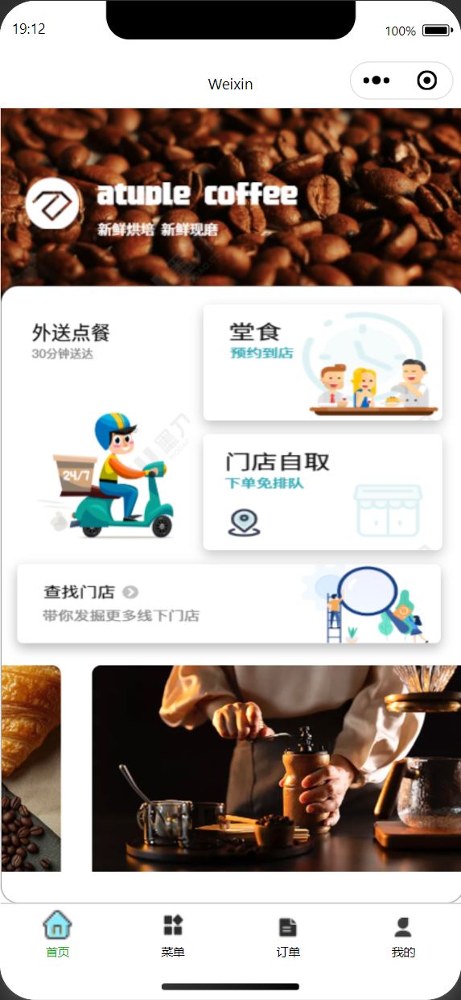
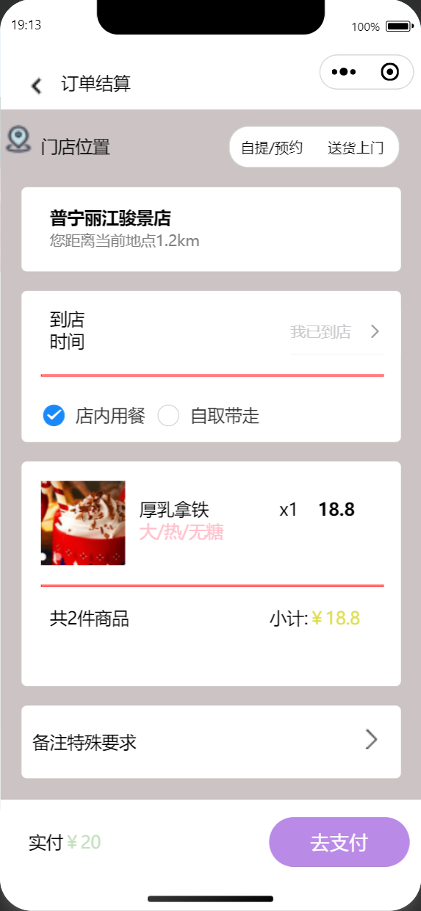
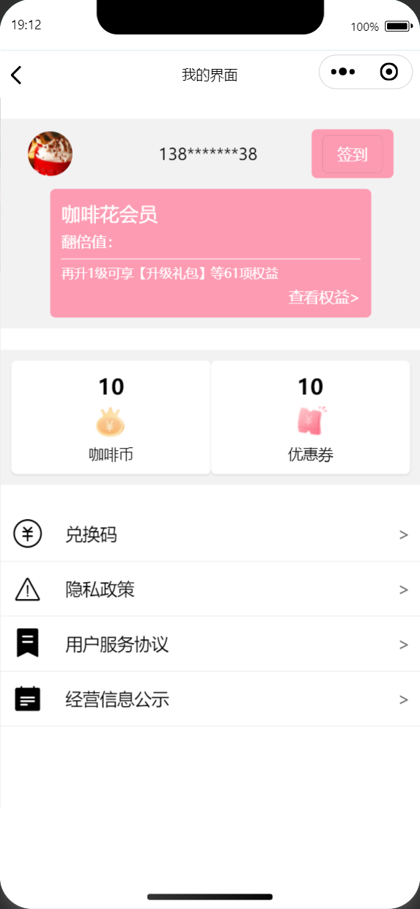
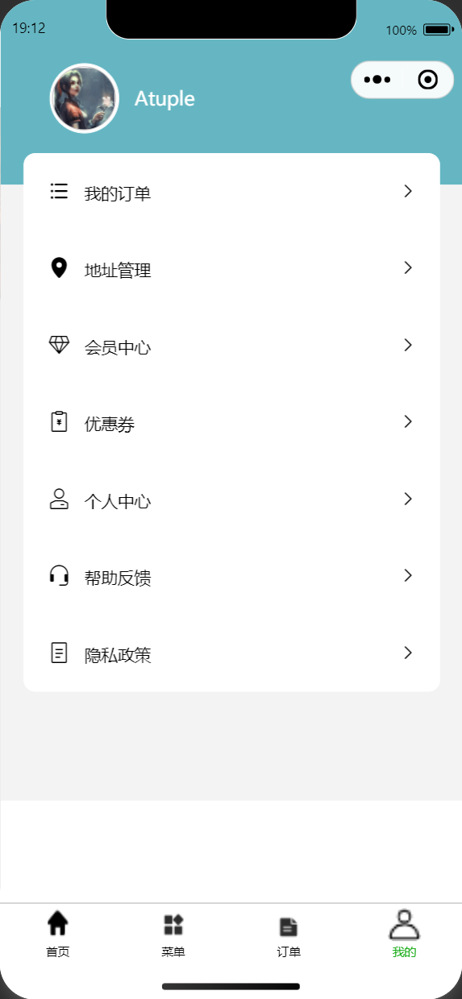
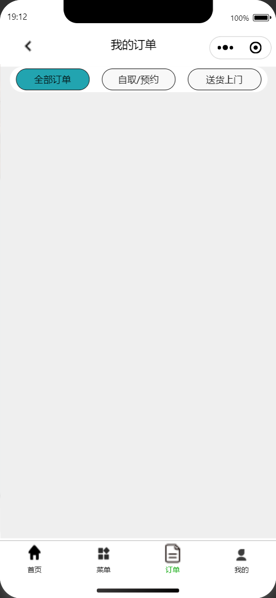

# 咖啡屋迷你小程序

## 项目介绍
一个基于小程序（微信小程序）的咖啡店点餐系统，该项目为合作共同完成的迷你版项目，包含商品展示、门店选择、会员中心、订单管理等功能模块。

## 技术栈
- 前端：微信小程序原生开发
- UI组件库：Vant Weapp (v1.11.7)
- 状态管理：小程序原生数据管理
- 构建工具：微信开发者工具

## 功能模块
1. **首页展示**
- 商品分类浏览
- 促销活动展示

2. **门店管理**
- 附近门店查询
- 门店详情展示

3. **会员中心**
- 会员信息管理
- 订单历史查询
- 优惠券管理

4. **购物流程**
- 商品加入购物车
- 订单结算
- 支付流程

5. **个人中心**
- 个人信息管理
- 地址管理

## 不足之处

1. **代码组织**
- 部分页面结构较为简单，缺少模块化拆分
- 状态管理分散在各页面，缺乏统一管理

2. **功能完整性**
- 部分页面如`KongYou`尚未开发完成
- 缺少后台数据接口说明文档
- 部分页面如订单管理功能不够完善

3. **性能优化**
- 未实现图片懒加载等性能优化措施
- 页面加载策略可进一步优化
- 缺少缓存机制，用户体验有待提升
- 未实现离线数据存储功能

4. **测试覆盖**
- 缺少单元测试和端到端测试
- 未提供测试用例文档

## 部分截图展示 
<table>
  <tr>
    <td></td>
    <td></td>
    <td></td>
  </tr>
</table>
<table>
  <tr>
    <td></td>
    <td></td>
    <td></td>
  </tr>
</table>

>更多内容请您下载观看